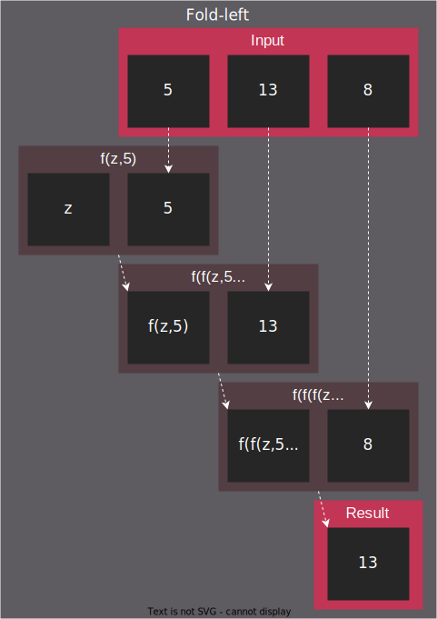
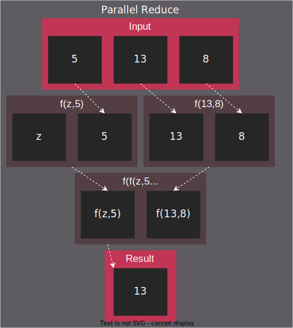
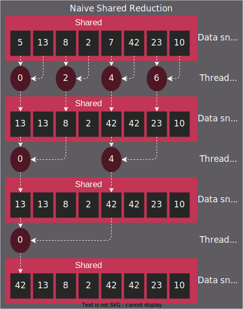
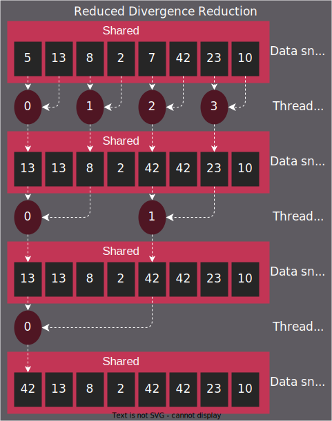

*************************************************************
Tutorial: Reduction
*************************************************************

Reduction is an algorithmic operation that doesn't trivially map to GPUs but is
ubiquitous enough to be of general interest while providing an excuse to
introduce some key considerations of designing GPU algorithms and optimizing
them.

*This article is a rejuvenation and extension of the invaluable work of Mark
Harris. While the author usually approaches the topic starting from a less
naive approach, it is still valuable to rehash some of the original material to
see how much the underlying hardware has changed. This article will go beyond
to demonstrate progress in the state of the art since.*

The algorithm
=============

Reduction has many names depending on the domain: in functional programming
it's referred to as
`fold <https://en.wikipedia.org/wiki/Fold_(higher-order_function)>`_,
in C++ it's been signidfied by ``std::accumulate`` and as of C++17 ``std::reduce``.
A reduction takes a range of inputs and "reduces" said range with a binary
operation to a singular/scalar output. Canonically a reduction requires a so
called "zero" element, which bootstraps the algorithm and serves as one of the
initial operands to the binary operation. ("Zero" element more generally is
called `identity or neutral <https://en.wikipedia.org/wiki/Identity_element>`_
element in group theory, meaning it is an operand which doesn not change the
result.) Typical use cases would be calculating a sum or wanting to normalize
a dataset and looking for the maximum value of a dataset. We'll be exploring
the latter in this tutorial.

There are multiple variations of reduction to allow parallel processing. One
such is what ``std::reduce`` does, is to require the user-provided binary
operator to operate on any combination of identity, and input range elements,
even exclusively one or the other. This allows inserting any number of
identities to allow parallel processing and then allows combining the partial
results of parallel execution.

Reduction on GPUs
=================

Implementing reductions on GPUs will require a basic understanding of the
:doc:`/understand/programming_model_reference`. The article explores aspects of low-level
optimization best discussed through the {ref}`inherent_thread_model`, and as
such will refrain from using Cooperative Groups.

Synchronizing parallel threads of execution across a GPU will be crucial for
correctness; we can't start combining partial results before they manifest.
Synchronizing _all_ the threads running on a GPU at any given time while
possible, is a costly and/or intricate operation. If not absolutely necessary,
we'll map our parallel algorithm as such that Multi Processors / Blocks can
make independent progress and need not sync often.

1. Naive shared reduction
--------------------------

The naive algorithm takes a tree-like shape, where the computational domain is
purposefully distributed among Blocks. In all Blocks all threads participate in
loading data from persistent (from the kernel's perspective) Global Memory into
Shared Memory, performing the tree-like reduction for a single thread to write
that partial result to Global in a location unique to the Block, allowing Block
to make independent progress. Combining these partial results will happen in
subsequent launches of the very same kernel until a scalar result is reached.

This approach will require temporary storage based on the number of Blocks
launched, as each will output a scalar partial result. Depending on whether it
is valid to destroy the input, a second temporary storage may be needed, large
enough to store the results of the second kernel launch, or one may simply
reuse the storage of the larger than necessary original input; these
implementations differ ever so slightly and the article will assume the input
may be destroyed.

.. code-block:: C++

    std::size_t factor = block_size; // block_size from hipGetDeviceProperties()
    auto new_size = [factor](const std::size_t actual)
    {
    	// Every pass reduces input length by 'factor'. If actual size is not divisible by factor,
    	// an extra output element is produced using some number of zero_elem inputs.
    	return actual / factor + (actual % factor == 0 ? 0 : 1);
    };

We'll be feeding ``zero_elem`` instances to threads that don't have unique inputs
of their own. The backing of double-buffering is allocated is such:

.. code-block:: C++

	// Initialize host-side storage
	std::vector<unsigned> input(input_count);
	std::iota(input.begin(), input.end(), 0);

	// Initialize device-side storage
	unsigned *front,
			 *back;
	hipMalloc((void**)&front, sizeof(unsigned) * input_count);
	hipMalloc((void**)&back,  sizeof(unsigned) * new_size(input_count));

	hipMemcpy(front, input.data(), input.size() * sizeof(unsigned), hipMemcpyHostToDevice);

Data is initialized on host and dispatched to the device. Then device-side
reduction may commence. We omit swapping the double-buffer on the last
iteration so the result is in the back-buffer no matter the input size.

.. code-block:: C++

	for (uint32_t curr = input_count; curr > 1;)
	{
		hipLaunchKernelGGL(
			kernel,
			dim3(new_size(curr)),
			dim3(block_size),
			factor * sizeof(unsigned),
			hipStreamDefault,
			front,
			back,
			kernel_op,
			zero_elem,
			curr);

		curr = new_size(curr);
		if (curr > 1)
			std::swap(front, back);
	}

This structure will persist throughout all the variations of reduction with
slight modifications to ``factor`` and shared memory allocation, but primarily
the kernel itself:

.. code-block:: C++

	template<typename T, typename F>
	__global__ void kernel(
		T* front,
		T* back,
		F op,
		T zero_elem,
		uint32_t front_size)
	{
		extern __shared__ T shared[];

		// Overindex-safe read of input
		auto read_global_safe = [&](const uint32_t i)
		{
			return i < front_size ? front[i] : zero_elem;
		};

		const uint32_t tid = threadIdx.x,
					bid = blockIdx.x,
					gid = bid * blockDim.x + tid;

		// Read input from front buffer to shared
		shared[tid] = read_global_safe(gid);
		__syncthreads();

		// Shared reduction
		for (uint32_t i = 1; i < blockDim.x; i *= 2)
		{
			if (tid % (2 * i) == 0)
				shared[tid] = op(shared[tid], shared[tid + i]);
			__syncthreads();
		}

		// Write result from shared to back buffer
		if (tid == 0)
			back[bid] = shared[0];
	}

While the ``tid % (2 * i) == 0`` indexing scheme yields correct results, it will
also result in high thread divergence. Thread divergence is when threads in a
warp/wavefront diverge, meaning they'd have to execute different instructions
on a given clock cycle. This manifests easiest using ``if/else`` branches like
here, but among others could also manifest as thread id dependent ``for`` loop
lengths. Even though there are less and less active threads participating in
the reduction, warps remain active (at least one lane in a warp hits the ``if``
branch) for longer than necessary.

2. Reducing thread divergence
-----------------------------

One may reduce divergence by keeping dataflow between memory addresses
identical but reassigning the thread ids.

.. note::

	For those less proficient in reading Git diffs, the coming code segments show
	changes between versions of a file. Lines highlighted in red are removed or
	changed while lines highlighted green are being introduced.

.. code-block:: diff

	// Shared reduction
	for (uint32_t i = 1; i < blockDim.x; i *= 2)
	{
	-	if (tid % (2 * i) == 0)
	-		shared[tid] = op(shared[tid], shared[tid + i]);
	+	if (uint32_t j = 2 * i * tid; j < blockDim.x)
	+		shared[j] = op(shared[j], shared[j + i]);
		__syncthreads();
	}

This way inactive threads start accumulating uniformly toward the higher thread
id index range and may uniformly skip to ``__syncthreads()``. This however
introduces a new issue: bank conflicts.

3. Resolving bank conflicts
---------------------------

Shared memory on both AMD and NVIDIA is implemented in hardware by storage
which is organized into banks of various sizes. On AMD hardware the name of
this hardware element is LDS, Local Data Share. On NVIDIA hardware it's
implemented using the same silicon as the L1 data cache. A truthful mental
model of shared memory is to think of it as a striped 2-dimensional range of
memory.

SHARED MEMORY BANKS IMAGE

Shared memory bank count, width and depth depend on the architecture at hand.
A bank conflict occurs when different threads in a warp/wavefront access the
same bank in the same operation. In this case, the "hardware prevents the
attempted concurrent accesses to the same bank by turning them into serial
accesses".

- `"AMD Instinct MI200" Instruction Set Architecture, Chapter 11.1 <https://www.amd.com/content/dam/amd/en/documents/instinct-tech-docs/instruction-set-architectures/instinct-mi200-cdna2-instruction-set-architecture.pdf>`_
- `"RDNA 2" Instruction Set Architecture, Chapter 10.1 <https://www.amd.com/content/dam/amd/en/documents/radeon-tech-docs/instruction-set-architectures/rdna2-shader-instruction-set-architecture.pdf>`_

A notable exception is when the shared read uniformly evaluates to the same
address across the entire warp/wavefront turning it into a broadcast. A
better change naive implementation is to have not only the activity of
threads form continous ranges but their memory accesses too.

.. code-block:: diff

	// Shared reduction
	-for (uint32_t i = 1; i < blockDim.x; i *= 2)
	-{
	-	if (tid % (2 * i) == 0)
	+for (uint32_t i = blockDim.x / 2; i != 0; i /= 2)
	+{
	+	if (tid < i)
			shared[tid] = op(shared[tid], shared[tid + i]);
		__syncthreads();
	}

.. note::

	It is easiest to avoid bank conflicts if one can read shared memory in a
	coalesced manner, meaning reads/writes of each lane in a warp evaluate to
	consequtive locations. Additional requirements must be met detailed more
	thoroughly in the linked ISA documents, but having simple read/write patterns
	help reason about bank conflicts.

4. Utilize upper half of the block
----------------------------------

The previous implementation was free of low-level GPGPU-specific anti-patterns,
however it does still exhibit a few common shortcomings. The loop performing
the reduction in shared memory starts from ``i = blockDim.x / 2`` and the first
predicate ``if (tid < i)`` immediately disables half of our block which only
helped load the data into shared. We change the kernel:

.. code-block:: diff

	const uint32_t tid = threadIdx.x,
				bid = blockIdx.x,
	-              gid = bid * blockDim.x + tid;
	+              gid = bid * (blockDim.x * 2) + tid;

	// Read input from front buffer to shared
	-shared[tid] = read_global_safe(gid);
	+shared[tid] = op(read_global_safe(gid), read_global_safe(gid + blockDim.x));
	__syncthreads();

and the calculation of ``factor`` on the host as well.

By eliminating half of the threads and giving meaningful work to all the
threads by unconditionally performing a binary ``op``, we don't waste half of our
threads.

While global memory is read in a coalesced fashion which the memory controller
prefers, we're still some ways from optimal performance, hinting at being
limited by instruction throughput.

5. Omit superfluous synchronization
-----------------------------------

Warps/Wavefronts are known to execute in a strictly* lockstep fashion,
therefore once shared reduction has reached a point when it's only a single
warp participating meaningfully, we can cut short the loop and let the rest of
the warps terminate, moreover without the need for syncing the entire block, we
can also unroll the loop.

The ``tmp`` namespace used beyond this point in the chapter holds a handful of
template meta-programmed utilities to facilitate writing flexible _and_ optimal
code.

:code:`tmp::static_for` is a variation of the language :code:`for`
loop where the running index is a compile-time constant and is eligible for use
in compile-time evaluated contexts not just constant folding within the
optimizer.

Consider the following code:

.. code-block:: C++

	constexpr int size = 4;
	for (int i = 0 ; i < size ; ++i)
	{
		printf("%d", i);
	}

This compiles to the following binaries:

**LLVM Block**

.. code-block::

	main:
		push    rbx
		lea     rbx, [rip + .L.str]
		mov     rdi, rbx
		xor     esi, esi
		xor     eax, eax
		call    printf@PLT
		mov     rdi, rbx
		mov     esi, 1
		xor     eax, eax
		call    printf@PLT
		mov     rdi, rbx
		mov     esi, 2
		xor     eax, eax
		call    printf@PLT
		mov     rdi, rbx
		mov     esi, 3
		xor     eax, eax
		call    printf@PLT
		xor     eax, eax
		pop     rbx
		ret
	.L.str:
		.asciz  "%d"

**GCC**

.. code-block:: asm

	.LC0:
		.string "%d"
	main:
		push    rbx
		xor     ebx, ebx
	.L2:
		mov     esi, ebx
		mov     edi, OFFSET FLAT:.LC0
		xor     eax, eax
		add     ebx, 1
		call    printf
		cmp     ebx, 4
		jne     .L2
		xor     eax, eax
		pop     rbx
		ret

**MSVC**

.. code-block::

	main    PROC
		$LN12:
		push    rbx
		sub     rsp, 32
		xor     ebx, ebx
		npad    8
	$LL4@main:
		mov     edx, ebx
		lea     rcx, OFFSET FLAT:'string'
		call    printf
		inc     ebx
		cmp     ebx, 4
		jl      SHORT $LL4@main
		xor     eax, eax
		add     rsp, 32
		pop     rbx
		ret     0
	main    ENDP

LLVM unrolls the the loop and compiles to a flat series of ``printf`` invocations
while GCC and MSVC both agree to keep the loop intact, visible from the compare
(``cmp``) and the jump (``jne``, ``jl``) instructions. LLVM codegen is identical to
us having written the unrolled loop manually:

.. code-block:: C++

	printf("%d", 0);
	printf("%d", 1);
	printf("%d", 2);
	printf("%d", 3);

While there are various non-standard pragmas availalbe to hint or force the
compiler to unroll the loop, we instead use template meta-programming to force
feed the compiler the unrolled loop.

.. code-block:: C++

	constexpr int size = 4;

	// Maybe unrolled loop
	for (int i = 0 ; i < size ; ++i)
	{
		printf("%d", i);
	}

	// Force unrolled loop
	using namespace tmp;
	static_for<0, less_than<size>, increment<1>>([]<int i>()
	{
		printf("%d", i);
	});

The most notable difference in structure is that in the language ``for`` loop we
start by giving the loop variable a name, while in our ``static_for`` utility we
give it a name at the end. An important bonus is that in the body of the loop
we can use the running index ``i`` in contexts requiring constant expressions:
as template arguments or inside ``if constexpr``.

:code:`tmp::static_switch` takes run-time value and run-time dispatches to
a range set of tabulated functions where said value is a compile-time constant
and is eligible for use in compile-time evaluated contexts.

Consider the following code:

.. code-block:: C++

	int warp_size = device_props.warpSize;
	switch (warp_size)
	{
	case 32:
		hipLaunchKernelGGL(kernel<32>, ...);
		break;
	case 64:
		hipLaunchKernelGGL(kernel<64>, ...);
		break;
	}

This all works fine as long as one doesn't commit copy-paste errors, as we had
to repeat the possible values of ``warp_size`` our code is prepared to handle.
This is what ``tmp::static_switch`` helps us with. The above is morally
equiavalent to:

.. code-block:: C++

	tmp::static_switch<std::array{32, 64}>(warp_size, [&]<int WarpSize>()
	{
		hipLaunchKernelGGL(kernel<WarpSize>, ...);
	});

.. code-block:: diff

	-template<typename T, typename F>
	+template<uint32_t WarpSize, typename T, typename F>
	__global__ void kernel(
		...
	)
	{
		...
	// Shared reduction
	-for (uint32_t i = blockDim.x / 2; i != 0; i /= 2)
	+for (uint32_t i = blockDim.x / 2; i > WarpSize; i /= 2)
	{
		if (tid < i)
			shared[tid] = op(shared[tid], shared[tid + i]);
		__syncthreads();
	}
	+// Warp reduction
	+tmp::static_for<WarpSize, tmp::not_equal<0>, tmp::divide<2>>([&]<int I>()
	+{
	+	if (tid < I)
	+		shared[tid] = op(shared[tid], shared[tid + I]);
	+#ifdef __HIP_PLATFORM_NVIDIA__
	+	__syncwarp(0xffffffff >> (WarpSize - I));
	+#endif
	+});

Because HIP typically targets hardware with warp sizes of 32 (NVIDIA GPUs and
RDNA AMD GPUs) as well as of 64 (CNDA AMD GPUs), portable HIP code must handle
both. That is why instead of assuming a warp size of 32 we make that a template
argument of the kernel, allowing us to unroll the final loop using
``tmp::static_for`` in a parametric way but still having the code read much like
an ordinary loop.

Promoting the warp/wavefront size to being a compile-time constant means we
have to do the same promotion on the host-side as well. We'll sandwich our
kernel launch with ``tmp::static_switch``, promoting the snake-case
run-time ``warp_size`` variable to a camel-case compile-time constant ``WarpSize``.

.. code-block:: diff

	// Device-side reduction
	for (uint32_t curr = input_count; curr > 1;)
	{
	+	tmp::static_range_switch<std::array{32, 64}>(warp_size, [&]<int WarpSize>() noexcept
	+	{
			hipLaunchKernelGGL(
	-			kernel,
	+			kernel<WarpSize>,
				dim3(new_size(curr)),
				dim3(block_size),
				factor * sizeof(unsigned),
				hipStreamDefault,
				front,
				back,
				kernel_op,
				zero_elem,
				curr);
	+	});
		...
	}

.. note::

	Neither RDNA nor CDNA based AMD hardware provide independent progress
	guarantees to lanes of the same wavefront. Lanes of a warp when targeting
	NVIDIA hardware may execute somewhat independently, so long as the programmer
	assists the compiler using dedicated built-in functions. (A feature called
	Independent Thread Scheduling.) The HIP headers do not expose the necessary
	warp primitives and their overloads.

	Portable applications can still tap into this feature with carefully
	``#ifdef`` -ed code, but in this particular optimiazion level it's a requirement.
	The code implicitly relies on the lockstep behavior of a wavefront, but warps
	do not share this property. We have to synchronize all the active lanes of a
	warp to avoid a data race by some lanes progressing faster than others in the
	same warp.

6. Unroll all loops
-------------------

While the previous step primarily aimed for removing the unnecessary syncing
only, it also went ahead and unrolled the end of the loop. We could however
force unrolling the first part of the loop as well. This saves a few scalar
registers (values the compiler can prove to be uniform across
warps/wavefronts).

.. code-block:: diff

	-template<uint32_t WarpSize, typename T, typename F>
	-__global__ void kernel(
	+template<uint32_t BlockSize, uint32_t WarpSize, typename T, typename F>
	+__global__ __launch_bounds__(BlockSize) void kernel(
		T* front,
		T* back,
		F op,
		T zero_elem,
		uint32_t front_size)
	{
	-	extern __shared__ T shared[];
	+	__shared__ T shared[BlockSize];

		...

		// Shared reduction
	-	for (uint32_t i = blockDim.x / 2; i > WarpSize; i /= 2)
	+	tmp::static_for<BlockSize / 2, tmp::greater_than<WarpSize>, tmp::divide<2>>([&]<int I>()
		{
	-		if (tid < i)
	-			shared[tid] = op(shared[tid], shared[tid + i]);
	+		if (tid < I)
	+			shared[tid] = op(shared[tid], shared[tid + I]);
			__syncthreads();
		}
	+	);

There are two notable changes beyond introducing yet another template argument
for the kernel and the moving from ``for`` to ``tmp::static_for``:

- We've added a new attribute to our kernel: ``__launch_bounds__(BlockSize)``.
  This attribute instructs the compiler that the kernel will only be launched
  using the designated block size. (Launches of differing block sizes will
  fail.) This allows the optimizer to enroll the ``blockDim.x`` variable in
  constant folding as well better reason about register pressure/usage.
- Turning the block size into a compile-time constant allows us to statically
  allocate shared memory.

7. Communicate using warp-collective functions
----------------------------------------------

Shared memory provides us with a fast communication path within a block, but
when performing reduction within the last warp/wavefront, we have an even
faster communication means at our disposal: warp-collective or cross-lane
functions. Instead of using the hardware backing shared memory we can directly
copy between the local memory (the registers) of each lane in a warp/wavefront.
The family of functions that allow us to do this are the shuffle functions.

We'll be using ``__shfl_down()``, one of the most restrictive but also most
structured communication schemes.

.. code-block:: C++

	// Warp reduction
	if (tid < WarpSize)
	{
		T res = op(shared[tid], shared[tid + WarpSize]);
		tmp::static_for<WarpSize / 2, tmp::not_equal<0>, tmp::divide<2>>([&]<int Delta>()
		{
			res = op(res, __shfl_down(res, Delta));
		});

		// Write result from shared to back buffer
		if (tid == 0)
			back[bid] = res;
	}

Moving to using warp-collective functions for communication means that control
flow has to be uniform across warps, much like the name warp-collective
implies. Therefore we externalized the thread id check outside the loop. (Write
out of the result moved inside due to variable scoping.)

8. Prefer warp communication over shared
----------------------------------------

Like we've mentioned in the previous step, communication between local memory
is faster than shared. Instead of relying on it solely at the end of the
tree-like reduction, it is possible to turn the tree reduction "inside out" and
perform multiple parallel warp reductions in parallel starting with all threads
are active, and communicate only their partial results through shared.

IMAGE OF FINAL ALGO

This version of the kernel differs significantly enough to not describe through
a diff but afresh.

.. code-block:: C++

	template<uint32_t BlockSize, uint32_t WarpSize, typename T, typename F>
	__global__ __launch_bounds__(BlockSize) void kernel(
		T* front,
		T* back,
		F op,
		T zero_elem,
		uint32_t front_size)
	{
		// ...
	}

The kernel signature looks the same, the factor of reduction is the same as in
previous cases, only the implementation differs.

.. code-block:: C++

	static constexpr uint32_t WarpCount = BlockSize / WarpSize;

	__shared__ T shared[WarpCount];

	auto read_global_safe =
		[&](const uint32_t i) { return i < front_size ? front[i] : zero_elem; };
	auto read_shared_safe =
		[&](const uint32_t i) { return i < WarpCount ? shared[i] : zero_elem; };

	const uint32_t tid = threadIdx.x,
				bid = blockIdx.x,
				gid = bid * (blockDim.x * 2) + tid,
				wid = tid / WarpSize,
				lid = tid % WarpSize;

	// Read input from front buffer to local
	T res = op(read_global_safe(gid), read_global_safe(gid + blockDim.x));

Because we communicate the results of warps through shared, we'll need as many
elements in shared as warps within out block. Much like we could only launch
kernels at block granularity to begin with, we can only warp reduce with
``WarpSize`` granularity (due to the collective nature of the cross-lane
built-ins), hence we introduce ``read_shared_safe`` to pad overindexing by
reading ``zero_elem`` -ents. Reading from global remains unchanged.

.. code-block:: C++

	// Perform warp reductions and communicate results via shared
	// for (uint32_t ActiveWarps = WarpCount;
	//      ActiveWarps != 0;
	//      ActiveWarps = ActiveWarps != 1 ?
	//          divide_ceil(ActiveWarps, WarpSize) :
	//          ActiveWarps = 0)
	tmp::static_for<
		WarpCount,
		tmp::not_equal<0>,
		tmp::select<
			tmp::not_equal<1>,
			tmp::divide_ceil<WarpSize>,
			tmp::constant<0>>>([&]<uint32_t ActiveWarps>()
	{
		if(wid < ActiveWarps)
		{
			// Warp reduction
			tmp::static_for<WarpSize / 2, tmp::not_equal<0>, tmp::divide<2>>([&]<int Delta>()
			{
				res = op(res, __shfl_down(res, Delta)); });

				// Write warp result from local to shared
				if(lid == 0)
					shared[wid] = res;
		}
		__syncthreads();

		// Read warp result from shared to local
		res = read_shared_safe(tid);
	});

	// Write result from local to back buffer
	if(tid == 0)
		back[bid] = res;

``ActiveWarps`` goes from ``WarpCount`` until it reaches ``0``, every iteration the
number of active warps reduces ``WarpSize``. To deal with cases when the partial
result count isn't a divisor of ``ActiveWarps`` and we need to launch an extra
warp, we're using ``tmp::divide_ceil`` which always rounds to positive infinity.
We need the tertiary ``tmp::select``, because such division never reaches ``0``, so
we must terminate the loop after once the last warp concluded.

In each iteration if the warp is active (has at least a single valid input) it
carries out a pass of warp reduction and writes output based on warp id.
Reading is based thread id. Global output is still based on block id.

9. Amortize bookkeeping variable overhead
-----------------------------------------

We have touched upon reducing register usage as a means of improving occupancy,
meaning allowing more blocks to execute in parallel on all Multi Processors
allowing more global store/load latency to be hidden. By reducing the number of
kernels in flight but still carrying out the same workload, we allow wasting
less registers on loading and maintaining bookkeeping variables such as kernel
indices.

One optimization we already did somewhat unknowingly in this direction was when
we performed one binary ``op`` while loading input from global. Do not let the
syntax fool you, there's no such thing as carrying out said operation "in
flight", the two values are loaded into local memory (registers) then ``op`` gets
called.

A more general form of this optimization is wrapping most of the kernel logic
with loops which all carry out the workload of multiple kernel instances but
require storing only a single instance of most of the bookkeeping logic. In
code we will refer to this multiplicity factor via the ``ItemsPerThread``
compile-time constant, supplied by a template argument to allow for loop
unrolling.

This kernel variant will utilize another utility which is generally applicable:
``hip::static_array`` is a more restrictive wrapper over the built-in array than
``std::array``, as it only allows indexing only compile-time constants using the
usual tuple-like ``template <size_t I> auto get<I>(...)`` interface.

.. note::

	This is important, because on a GPU there is no stack, but local memory is
	provisioned from the register file and this provisioning happens statically.
	To paraphrase, the address range of a thread's local memory is determined at
	compile time. When an array is defined and used in local storage, the
	compiler can only maintain its storage in the register file as long as all
	access to the array is computable by the compiler at compile-time. It need
	not strictly be a compile-time constant, if through constant folding or some
	other means the compiler can resolve the addresses of the accesses. However,
	if it cannot, the array will be backed by global memory (indicated by
	allocating a non-zero number of spill registers observable using static
	analysis tools) which is multiple orders of magnitude slower.
	``hip::static_array`` via its ``hip::get<>`` interface guarantees that no such
	spills will occur.

.. code-block:: C++

    template<uint32_t BlockSize, uint32_t WarpSize, uint32_t ItemsPerThread>
    __global__ static __launch_bounds__(BlockSize) void kernel(...)

Our kernel as promised now has three compile-time configurable parameters. The
only part of the kernel that changes is how we load data from global and how we
perform the binary operation on those loaded values. What used to be the
one-liner:

.. code-block:: C++

    // Read input from front buffer to local
    T res = op(read_global_safe(gid), read_global_safe(gid + blockDim.x));

is going to be split now to a reading and a processing step.

Reading ``ItemsPerThread``
--------------------------

The change to reading is going to happen inside `read_global_safe`:

.. code-block:: C++

	auto read_global_safe = [&](const int32_t i) -> hip::static_array<T, ItemsPerThread>
	{
		return [&]<int32_t... I>(std::integer_sequence<int32_t, I...>)
		{
			if(i + ItemsPerThread < front_size)
				return hip::static_array<T, ItemsPerThread>{
					front[i + I]...
				};
			else
				return hip::static_array<T, ItemsPerThread>{
					(i + I < front_size ? front[i + I] : zero_elem)...
				};
		}(std::make_integer_sequence<int32_t, ItemsPerThread>());
	};

What's happening here? Without the flexibility of a configurable
``ItemsPerThread`` property, we'd want to load each array element one after the
other, morally equivalent to:

.. code-block:: C++

	T arr[4] = {
		front[gid + 0],
		front[gid + 1],
		front[gid + 2],
		front[gid + 3]
	}

This is exactly what's happening in the ``front[i + I]...`` fold-expression.
There is a condition though: we only issue this if the entire read is operating
on real input and it's not padding using ``zero_elem``. If some reads would
overindex the input, the read turns into:

.. code-block:: C++

	T arr[4] = {
		i + 0 < front_size ? front[i + 0] : zero_elem,
		i + 1 < front_size ? front[i + 1] : zero_elem,
		i + 2 < front_size ? front[i + 2] : zero_elem,
		i + 3 < front_size ? front[i + 3] : zero_elem
	}

Why do we do this? Because we want to make it easier for the compiler to
recognize vector loads from global. Because our performance at large is
dominated by how we move our data, as we've seen by the huge performance
improvement when we moved to loading two values per thread, it's only natural
we wish to utilize dedicated instructions to moving more data with less binary.
See `here <https://godbolt.org/z/b36Eea69q>`_ how loading for AMD (both RDNA and
CDNA) compiles to ``global_load_dwordx4`` where ``x4`` denotes the 4-vector variant
of the instruction.

.. note::

	Eagle eyed readers may have noticed that ``read_global_safe`` used to take an
	``uint32_t`` as the index type and now it takes a signed integer. When indexing
	an array with unsigned integrals, the compiler has to handle integer
	overflows as they're defined by the C/C++ standards. It may happen, that some
	part of the vector load indices overflow, thus not resulting in a contiguous
	read. If you change the previously linked code to use an unsigned integral as
	the thread id, the compiler won't emit a vector load. Signed integer overflow
	is undefined behavior, and the optimizer assumes that a program has none in
	it. To convey the absence of overflow to the compiler with unsigned indices,
	add ``__builtin_assume(gid + 4 > gid)``, or the more portable
	``[[assume]](gid + 4 > gid)`` once ``amdclang++`` supports it.

To conclude ``read_global_safe``'s implementation, it's an IILE (Immediately
Invoked Lambda Expression), becasue ``ItemsPerThread`` is an integral value, but
we need a compile-time ``iota``-like sequence of integers _as a ``pack_`` for our
fold-expression to expand on, that change can only occur as part of template
argument deduction, here on the immediately invoked template lambda.

Processing ``ItemsPerThread``
-----------------------------

Once the kernel reads ``ItemsPerThread`` number of inputs to local, it will
immediately reduce them to a scalar. There is no reason to propagate the input
element multiplicity to the warp reduction phase; cross-lane shuffles are
cheap, no shuffling is even cheaper.

.. code-block:: C++

	T res = [&]()
	{
		// Read input from front buffer to local
		hip::static_array<T, ItemsPerThread> arr = read_global_safe(gid);

		// Reduce ItemsPerThread to scalar
		tmp::static_for<1, tmp::less_than<ItemsPerThread>, tmp::increment<1>>([&]<int I>()
		{
			get<0>(arr) = op(get<0>(arr), get<I>(arr));
		});

		return get<0>(arr);
	}();

Outlook
=======

There are multiple ways one could take optimization further.

10. Two-pass reduction
----------------------

Alter kernel launch and input fetching such that no more blocks are launched
than what a subsequent kernel launch's single block can conveniently reduce,
while performing multiple passes of input reading from global (and combine
their) results before engaging in the end-game tree-like reduction.

With this method, one can save 1-2 kernel launches for really large inputs.

11. Global Data Share
---------------------

.. warning::

	This modification can only be executed on AMD hardware.

Perform the first step of the two-pass reduction, but at the end, instead of
writing to global and reading it back in a subsequent kernel, write the partial
results to the Global Data Share (aka. GDS). This is an ``N+1`` th shared memory
which all Multi Processors can access and is also on-chip memory.

.. note::

	The order in which blocks are scheduled isn't guaranteed by the API, even
	though all GPUs in existence schedule them the same way, monotonically
	increasing in their block id. Relying on this implicitly, the last block of a
	grid is in the optimal position to observe the side-effects of all other
	blocks (using spinlocks, or anything else) without occupying a Multi
	Processor for longer than necessary.

Without launching a second kernel, have the last block collect the results of
all other blocks from GDS (either implicitly exploiting the sceduling behavior
or relying on Global Wave Sync, yet another AMD-specific feature) to merge them
for a final tree-like reduction.

.. note::

	Both GDS and GWS aren't covered by the HIP API but reserved features of the
	runtime. Invoking these functionalities currently requires inline AMDGCN
	assemby. Furthermore because the GDS isn't virtualized by the runtime,
	imposing further restrictions on concurrent scheduling of other kernels.

Conclusion
==========

Optimizing code on GPUs, like on any other architecture requires careful
consideration and balancing of resources and costs of various operations to
obtain optimal performance. This tutorial explored optimizing reductions well
beyond the territory of diminishing returns. This was deliberate to supply an
excuse to introduce multiple optimization techniques and opportunities as well
as necessary when accounting for the larger picture.

Here we focused on reductions when an entire device participates in it, but the
choice of optimal compile-time constants or even the algorithm itself may not
be optimal in cases when it's multiple blocks participating in multiple
parallel reductions or even each thread doing a reduction of their own. Going
in the opposite direction, when multiple devices participate in the same
reduction a whole new set of aspects must be considered.

Most of these cases, including the one we just covered in this article, is
given to end-users in a turn-key fashion via algorithm primitive libraries.
They may not be the fastest in all of the cases, but are as close to being gold
standards of carrying out certain operations as reasonably possible.
